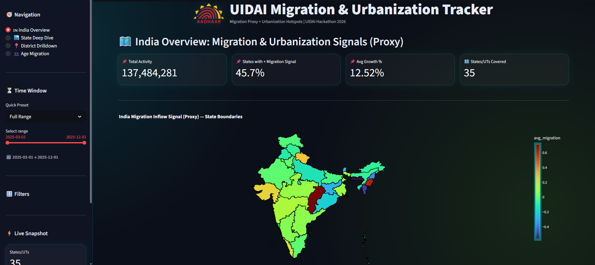
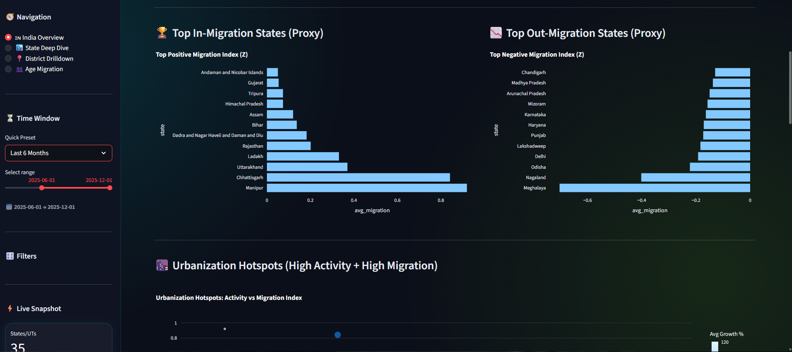
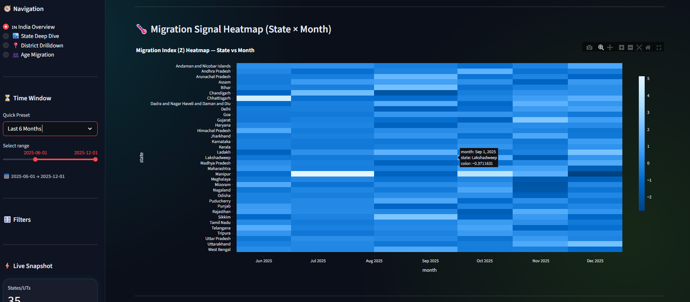
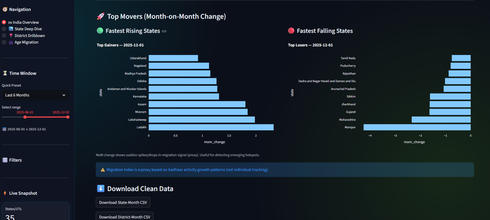

# UIDAI Hackathon 2026 — Migration & Urbanization Tracker 🛰️

## Problem Statement
India experiences large-scale migration due to employment, education, family movement, and urbanization. However, real-time migration tracking is difficult using traditional surveys.

This project builds an **interactive migration & urbanization analytics dashboard** using **UIDAI Aadhaar update datasets** as a **proxy signal** to identify:

- Migration hotspots (inflow/outflow)
- Net gain / net loss regions
- Age-group migration dominance
- Temporal trends across months
- Urbanization patterns

---

##  Key Features
- 🇮🇳 India Overview choropleth map (state boundaries)
-  State ranking: Top In-migration vs Out-migration (proxy)
-  Urbanization hotspots scatter plot (activity vs migration index)
-  Heatmap: Migration Index (State × Month)
-  Top Movers: Month-on-Month change detection
-  State Deep Dive (trend + top districts)
-  District Drilldown (district trend + age activity)
-  Age Insights (proxy): trend + adult share % + age share donut

---
## Data Used (UIDAI Dashboard Data)

- We used monthly aggregated UIDAI dashboard datasets:
- dashboard_state_month.csv → state-level migration proxy trends
- dashboard_district_month.csv → district-level migration proxy trends
- Age Groups Available in Dataset
- The UIDAI dashboard provides migration proxy counts by age:
-   0–5
-   5–17
-   18+

## Methodology (How Metrics Are Computed)

This project uses UIDAI Aadhaar update activity as a **proxy indicator** for migration patterns. It does not track individuals.

### 1) Net Migration
-      Net = Inflow - Outflow
       Net > 0 → Net gaining region
       Net < 0 → Net losing region

### 2) Migration Index
-      MigrationIndex = (Inflow - Outflow) / (Inflow + Outflow + 1)

- ## Why +1?
    -   Prevents division by zero
    -   Stabilizes the index for low counts

- ## Interpretation:
    -   Near +1 → strong inflow hotspot
    -   Near -1 → strong outflow hotspot
    -   Near 0 → balanced movement


## Age Group Share
                
-               TotalMigrants = age_0_5 + age_5_17 + age_18_greater -->
                
-                AgeShare(%) = (AgeGroupCount / TotalMigrants) * 100
        
    ### Age Groups Available
        The UIDAI dashboard provides migration proxy counts by age:
        - **0–5**
        - **5–17**
        - **18+**


##  Important Note (Proxy Disclaimer)
This dashboard uses **aggregated UIDAI activity data**.  
The **Migration Index is a proxy signal**, based on activity and growth patterns.  
It does **NOT track individuals** and does **NOT represent exact migration counts**.

---

##  Project Structure
uidai-hackathon-2026-migration/
│
├── dashboard/
│   ├── app.py
│   ├── requirements.txt
│   └── india_states.geojson
│
├── data/
│   ├── dashboard_state_month.csv
│   └── dashboard_district_month.csv
│
├── notebook/
│   └── UIDAI_Migration_Urbanization_Analysis.ipynb
│
├── assets/
│   ├── aadhaar_transparent.png
│   ├── 1-front.png
│   ├── 2-migration-in-out.png
│   ├── 3-heatmap.png
│   └── 4-gainers.png
│
├── .gitattributes
└── README.md

---

##  Dashboard Preview

### India Overview (Map + KPIs)


### Migration In vs Out


### Migration Heatmap


### Top Movers (Gainers / Losers)


---
## Dashboard Features
-    🇮🇳 India & State-Level Views
-    India overview migration map (choropleth)
-    State-wise inflow vs outflow comparison
-    Net migration & migration index trend analysis
-    Top gaining and top losing states (ranked)
    ### District-Level Views
    -    District hotspot identification
    -    District-wise monthly migration heatmaps
    -    Top migration routes (where applicable)
    -    District gainers/losers table
    ### Age Group Migration Insights
    -    0–5 vs 5–17 vs 18+ migration distribution
    -    Adult migration dominance (workforce movement)
    -    Family migration signal through child share

##  How to Use
- Use sidebar to switch pages (India / State / District / Age)
- Use Time Window slider to filter months
- Use State/District filters for drilldown insights

## Key Insights (From Dashboard Observations)
-   Migration is dominated by the 18+ age group, indicating migration is primarily driven by employment and higher education opportunities.
-   0–5 and 5–17 migration share suggests a portion of movement happens as family migration, where children relocate with parents.
-   Regions with consistently positive net migration act as urbanization hotspots, showing higher attraction due to jobs, infrastructure, and services.
-   Monthly patterns show time-based spikes, indicating seasonal movement or work-cycle-driven migration.

## Real-World Use Cases (Why This Matters)
-    ## This dashboard can support:

    -   Urban planning: identify high-inflow regions needing housing, transport, and public services

    -   Employment planning: track workforce movement and job-driven migration

    -   Education planning: observe youth/student movement trends

    -   Healthcare infrastructure: plan resources for high-growth regions

    -   Policy making: identify high outflow regions needing local job creation

## Limitations
- This dashboard represents **Aadhaar update activity**, not direct tracking of migration.
- Some people may migrate without updating Aadhaar immediately.
- Counts reflect **proxy relocation signals**, not short-term travel.

##  Future Work
- Add simple forecasting for next 3 months (trend-based prediction)
- Add district-to-district movement network visualization
- Improve validation by comparing with census/urban population growth indicators


##  Run Locally

### 1) Clone the repo
```bash
git clone https://github.com/ansh-jyo/uidai-hackathon-2026-migration.git
cd uidai-hackathon-2026-migration


pip install -r dashboard/requirements.txt
streamlit run dashboard/app.py

http://localhost:8501


